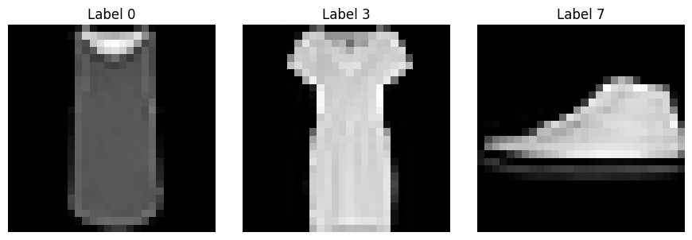
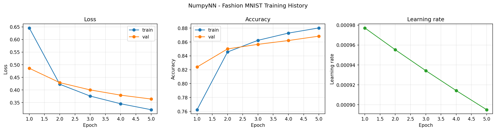
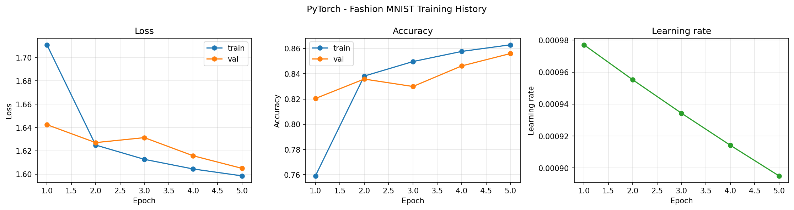
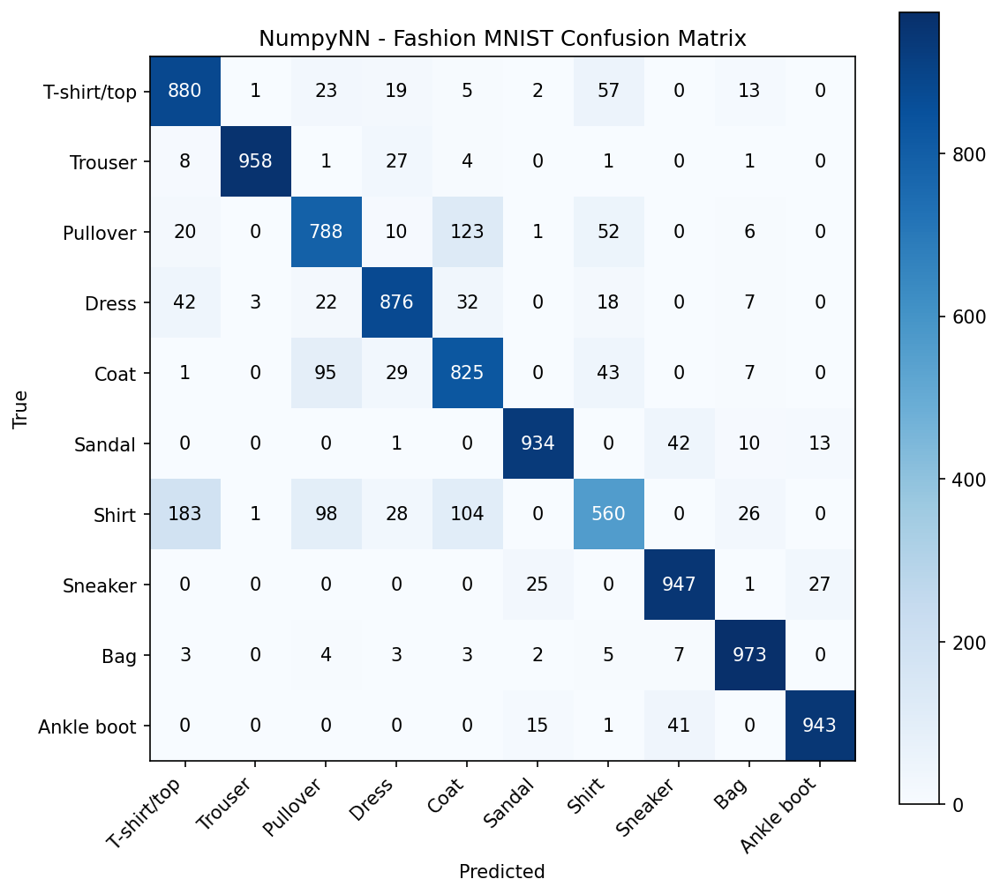
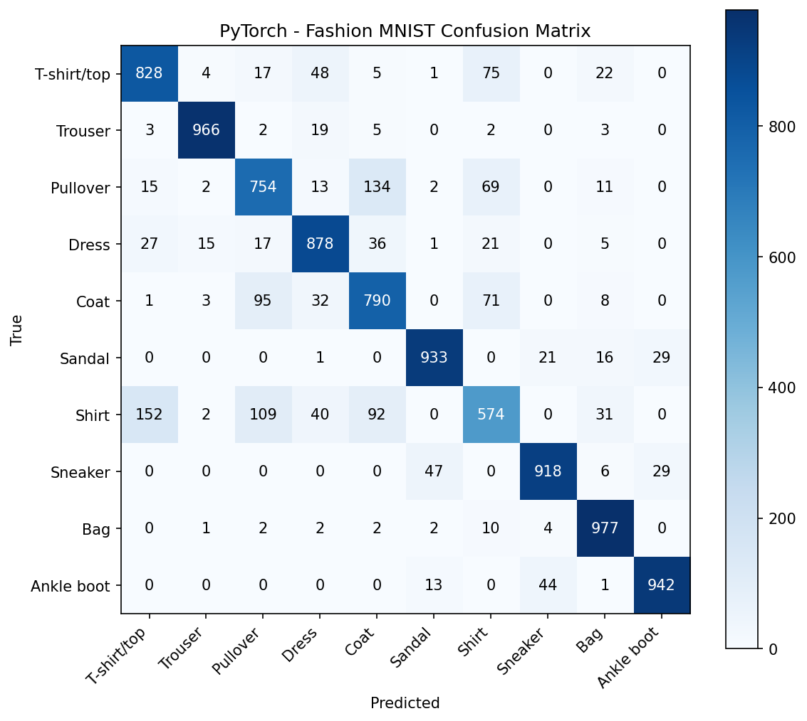
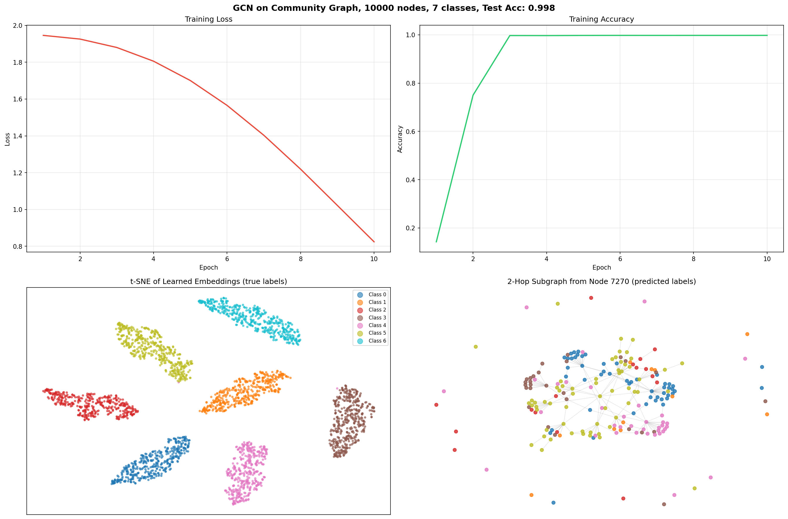

# NpyNN

A neural network library built from scratch using only NumPy, no deep learning frameworks.

## Installation

```bash
git clone https://github.com/your-username/numpynn.git
cd numpynn
pip install -e .
```

Install PyTorch and TorchVision
```bash
pip install torch
pip install torchvision
```

## Quick Start

```python
from numpynn import *

model = Model(
  Dense(784, 128),
  ReLU(),
  Dense(128, 10),
  Softmax()
)

model.set(
    loss=CategoricalCrossEntropy(),
    optimizer=Adam(decay=5e-5),
    accuracy=Accuracy_Categorical()
)

model.finalize()
model.train(X, y, epochs=5, batch_size=128, validation_data=(X_test, y_test))
```

## Using GNNs

Graph Neural Networks operate on graph-structured data (nodes + edges) rather than flat feature vectors. Use `GraphModel` and pass your adjacency matrix via `set_graph()`:

```python
from numpynn import *

model = GraphModel(
  GCNLayer(num_features, 16),
  ReLU(),
  GCNLayer(16, num_classes),
  Softmax() 
)

model.set(
    loss=CategoricalCrossEntropy(),
    optimizer=Adam(learning_rate=0.01),
    accuracy=Accuracy_Categorical()
)

# set graph with adjacency matrix
model.set_graph(adj_matrix=A)

model.finalize()
model.train(X, y, epochs=200)
```

## Features

<table>
<tr><th>Core</th><th>Extensions</th></tr>
<tr><td>

| Category | Implementations |
|---|---|
| Layers | Dense, Dropout |
| Activations | ReLU, Sigmoid, Softmax, Linear |
| Loss | Categorical Cross Entropy, Binary Cross Entropy, MSE |
| Optimizers | SGD, Adam, RMSProp, Adagrad |
| Regularization | L1, L2 |
| Utilities | Model saving, loading, batch training, validation |

</td><td>

| Category | Implementations |
|---|---|
| Graph Layers | GCNLayer, MessagePassing |
| Graph Models | GraphModel |
| Activations | LeakyReLU, Tanh |

</td></tr>
</table>

## Fashion MNIST Example

Fashion MNIST is a dataset of 60,000+ grayscale images across 10 clothing categories:

| Label | 0 | 1 | 2 | 3 | 4 | 5 | 6 | 7 | 8 | 9 |
|---|---|---|---|---|---|---|---|---|---|---|
| Class | T-shirt/Top | Trouser | Pullover | Dress | Coat | Sandal | Shirt | Sneaker | Bag | Ankle Boot |



### Train

**NumpyNN**
```bash
python3 -m fashion_mnist.numpynn.numpynn_train_fashion_mnist
```

**PyTorch**
```bash
python3 -m fashion_mnist.torch.torch_train_fashion_mnist
```

### Load pretrained

**NumpyNN**
```bash
python3 -m fashion_mnist.numpynn.numpynn_load_fashion_mnist
```

**PyTorch**
```bash
python3 -m fashion_mnist.torch.torch_load_fashion_mnist
```


## Results

### Validation on Test Data
---
**NumpyNN Validation**
```bash
validation, acc: 0.868, loss: 0.364
```

**PyTorch Validation**
```bash
validation, acc: 0.856, loss: 1.605
```

### Training History
---
**NumpyNN**



**PyTorch**



### Confusion Matrix
---
<p float="left">
  
  
</p>

## Synthetic Dataset Example (with `GCNLayer`)
Stochastic block model with 7 communities and 10K nodes.

Run:
```python
python3 numpynn_gcn_synth.py
```

## Results

```
Training time: 4.8s

Results:
  Train accuracy: 0.990
  Test accuracy:  0.986
```

### Training Loss, Training Accuracy, t-SNE, and 2-Hop Subgraph from Node 7270
---
- **Node 7270** is random from set seed. Just to show the local neighborhood structure the GCN actually aggregates over during message passing.



## Future Work
- Add pooling (e.g. MaxPool, MeanPool).
- Other model architectures...

## Acknowledgements

Big thanks to [sentdex](https://www.youtube.com/@sentdex) and the [NNFS book](https://nnfs.io/) which this project is based on.